# Spring MVC

## 環境構築

### eclipseにEmmetプラグインの追加

eclipseでHTMLのコーディングの生産性を上げるために、参考ページの手順でEmmetプラグインをいれておいてください。

**参考ページ**

https://blog.goo.ne.jp/siyokuanjin/e/43764761c736fe29f9a13cec6312e7be

### 依存関係の追加

Spring MVCを利用するためには依存関係を追加する必要があります。下図のとおり依存関係を追加してください。

- さらに今回は自動でプログラム修正時にアプリケーションを再起動してくれる`spring-boot-devtools`も入れています。

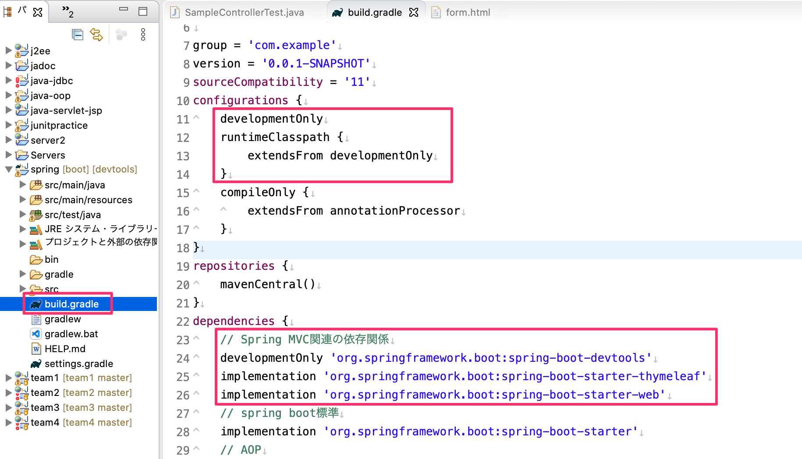

## 基本的なSpring MVC機能の確認

基本的なControllerの作成のしかたを確認します。

### コントローラー・リクエストハンドラの実装

ベースパッケージに`controller`パッケージを作成して`HelloController.java`クラスを作成し、下図のとおりにコントローラーに必要なアノテーション、ハンドラメソッドを追加します。

- コントローラーにするクラスには`@Controller`を付与します。
- またクラスの箇所に`@RequestMapping("hello")`も追加し、`http://localhost:8080/hello`のHTTPリクエストで受け取れるようにしています。
- `hello`メソッド（メソッド名は任意）を作成して戻り値の型を`String`にし、`@GetMapping`を付与しています。
  - これで`http://localhost:8080/hello`の`GET`メソッドで受け取るハンドラメソッドになります。
  - 戻り値にはViewのパスを指定しています。
    - `src/main/resources/templates`を基点とした相対パスで`.html`の拡張子なしで指定します。

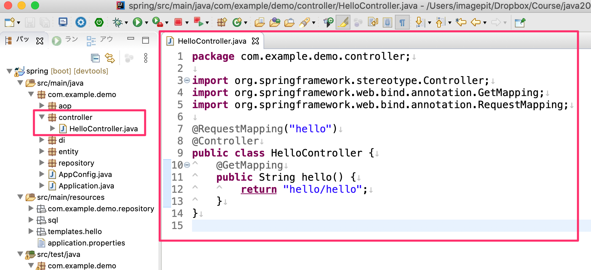

#### Viewの作成

`src/main/resources`に`templates/hello`フォルダを作成して`hello.html`を作成します。

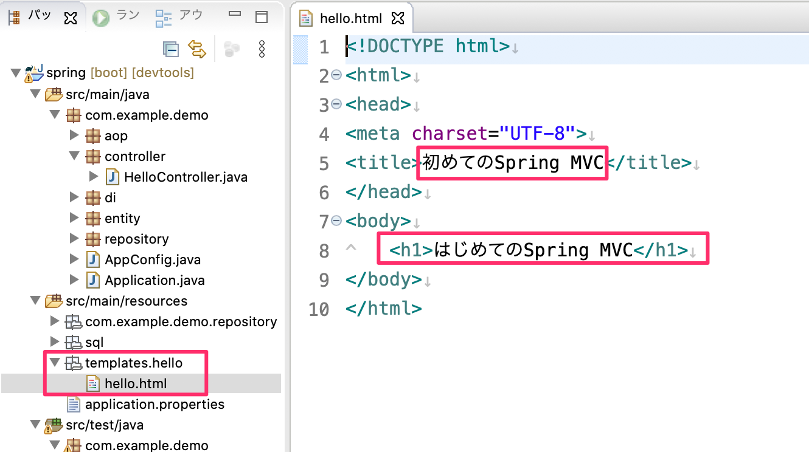

#### 動作確認

ベースパッケージにある`Application.java`を右クリックしてSpring Bootアプリケーションを起動します。

- `http://localhost:8080/hello`でViewで定義したHTMLが表示される事を確認してください。

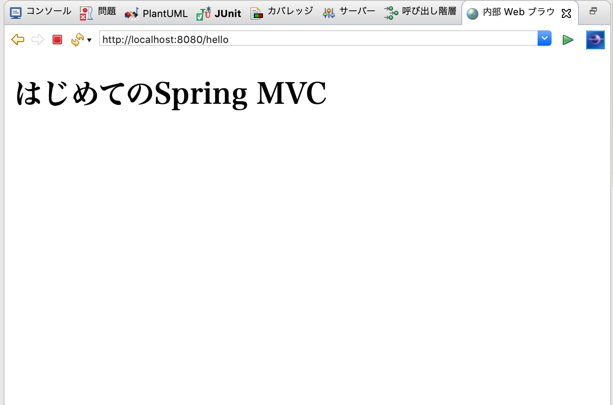

### @PostMappingとリダイレクトの確認

次にHTTPのPOSTメソッドで受け取るためのハンドラメソッドを追加して、リダイレクト処理をさせてみます。

下図のように`hello.html`の`h1`タグの下に`form`タグでリダイレクトボタンを追加します。

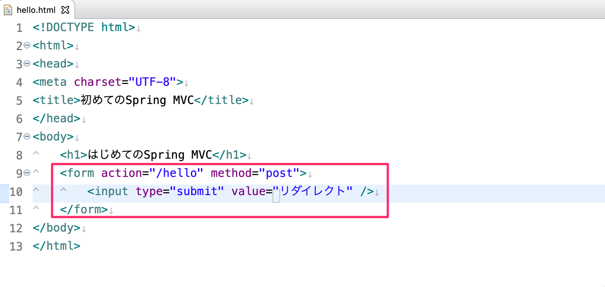

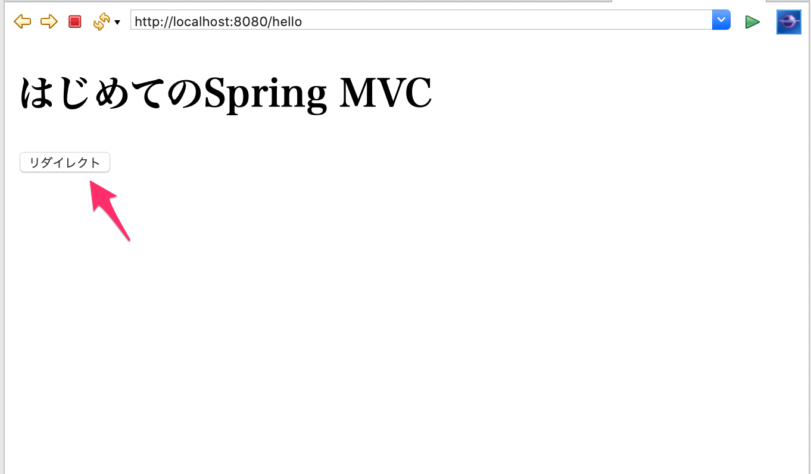

`HelloController`を下図のように更新します。

- `@PostMapping`を付与した`post`のハンドラメソッドを追加します。
  - これで`hello.html`からのリダイレクトボタンをクリックした後のPOSTメソッドのHTTPリクエストを受け取れるようになります。
  - 戻り値は今回はリダイレクトさせたいので`redirect:/hello/redirect`を指定しています。
    - これで`http://localhost:8080/hello/redirect`へリダイレクトします。
- `@GetMapping("redirect")`を付与した`post`のハンドラメソッドを追加します。
  - `http://localhost:8080/hello/redirect`のリクエストを受け取ります。
  - 戻り値は今回はリダイレクトさせたいので`hello/redirect`を指定して`src/main/resources/templates/hello`フォルダの作成して`redirect.html`のViewを表示させるようにします。

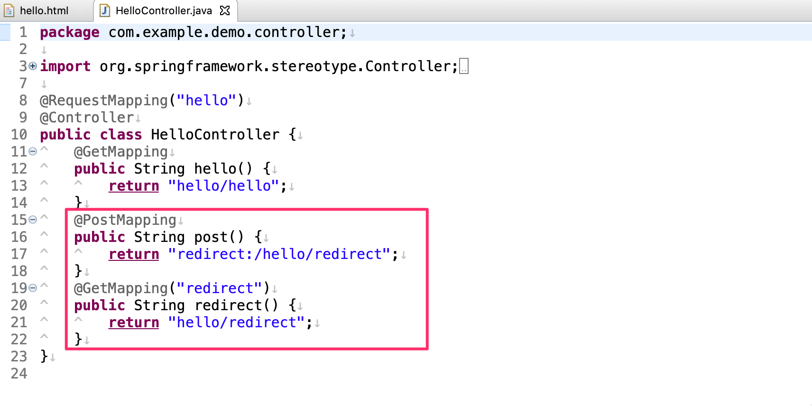

#### リダイレクト用のViewの作成

`src/main/resources/templates/hello`フォルダの作成に`redirect.html`を作成して下図のとおりにHTMLを更新します。

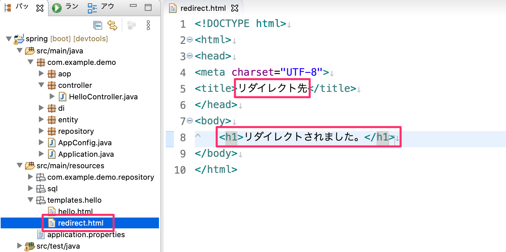

#### 動作確認

`http://localhost:8080/hello`にアクセスしリダイレクトボタンをクリックしたら`http://localhost:8080/hello/redirect`へリダイレクトされる事を確認してください。

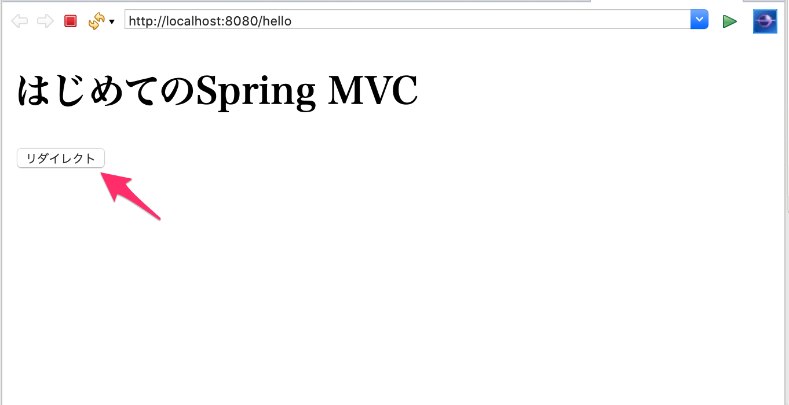

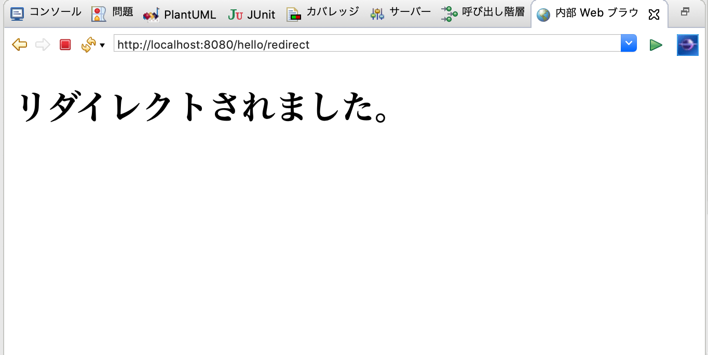

## 演習問題

下図のような遷移になるようにControllerクラス・ハンドラメソッド・Viewを作成しなさい。

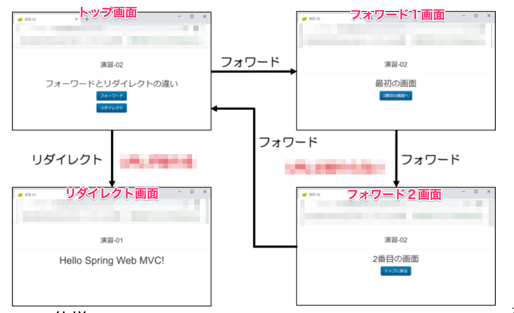

|クラス名（FQCN）|
|---|
|`com.example.demo.controller.Practice01Controller`|

画面名|メソッド名|アノテーション|戻り値
---|---|---|---
トップ画面|home|`@GetMapping`|practice01/home
フォワード1画面|forward|`@GetMapping("forward")`|practice01/first
フォワード2画面|second|`@GetMapping("second")`|practice01/second
リダイレクト|redirect|`@GetMapping("redirect")`|redirect:/practice01/redirect
リダイレクト画面|redirected|`@GetMapping("redirected")`|practice01/redirected