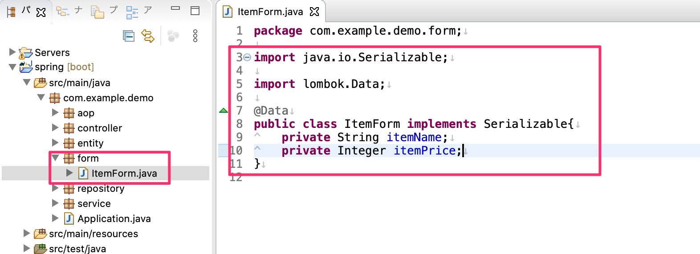
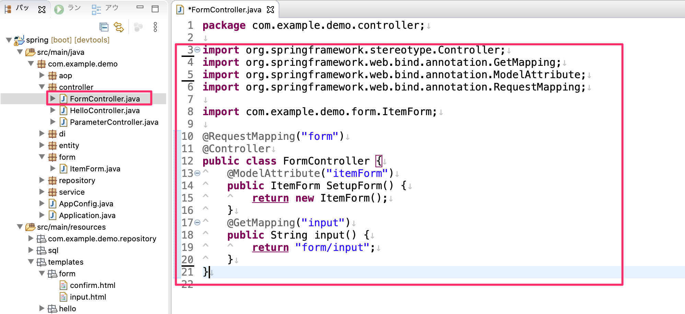
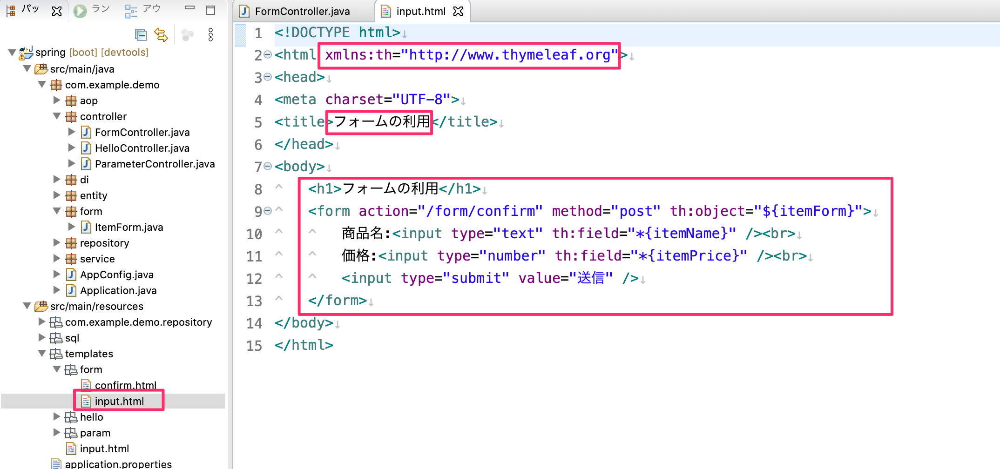
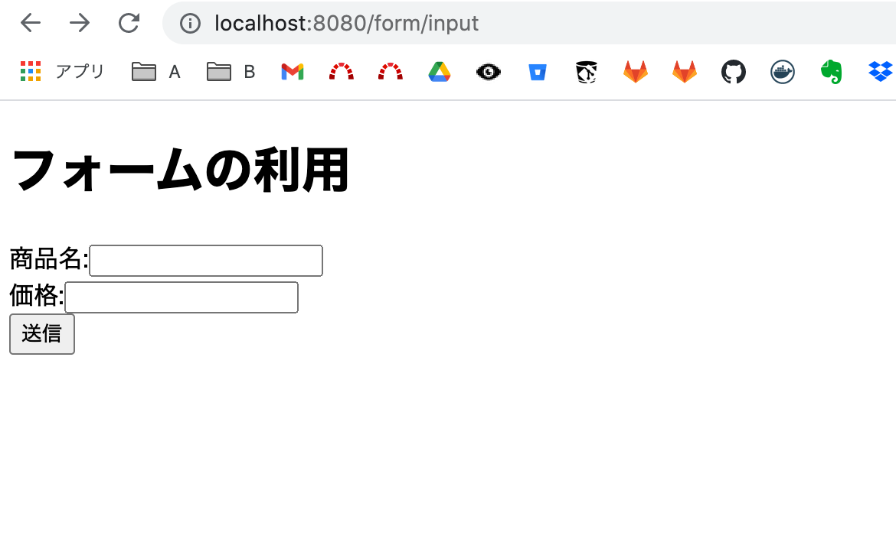
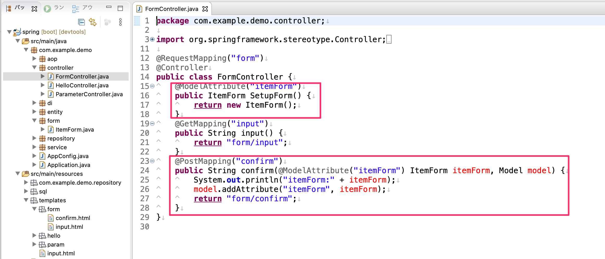
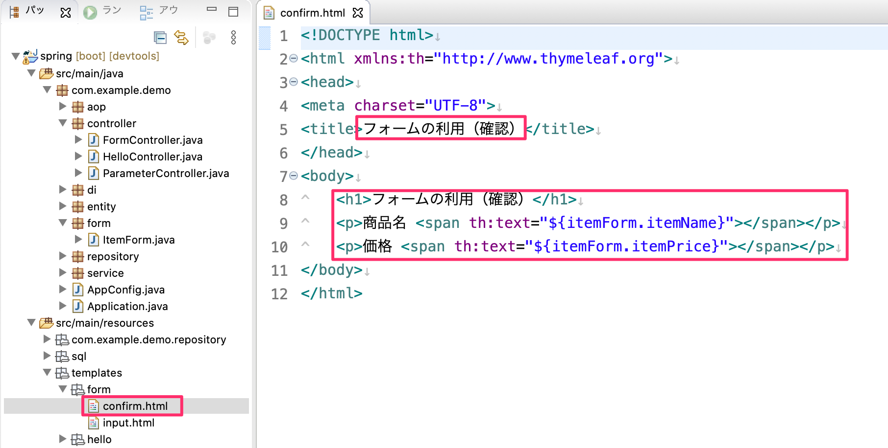
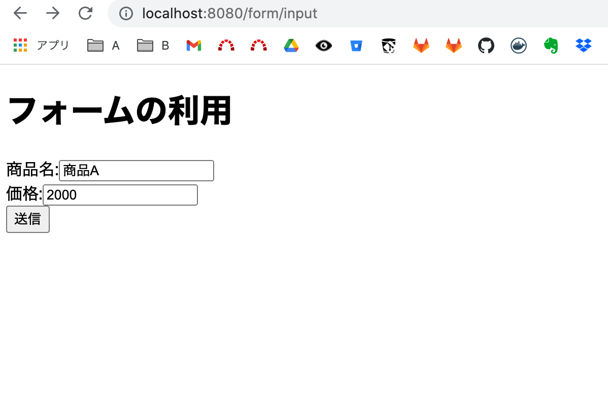
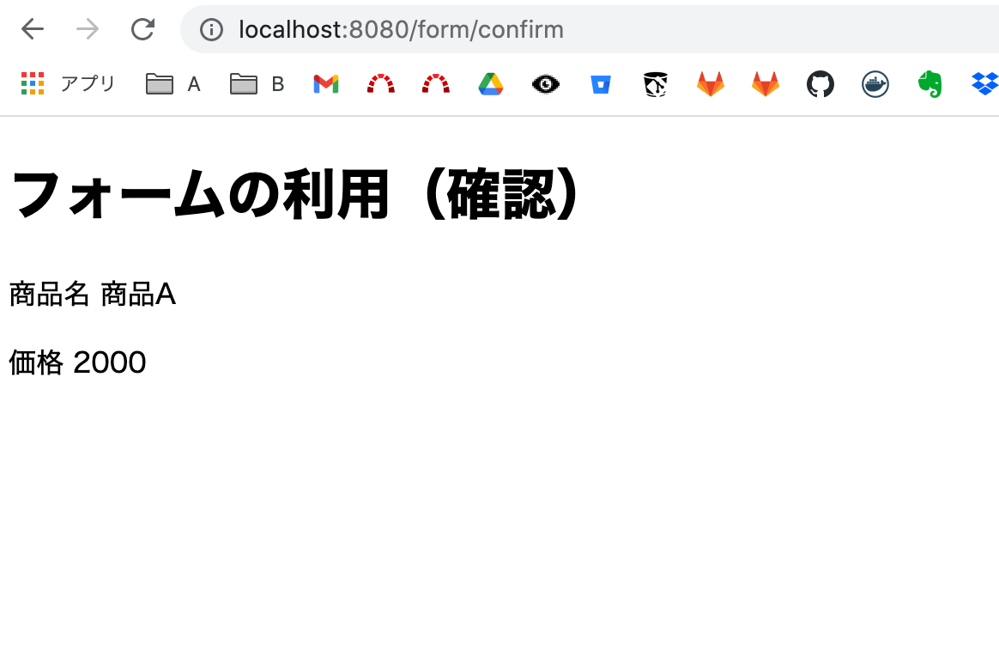
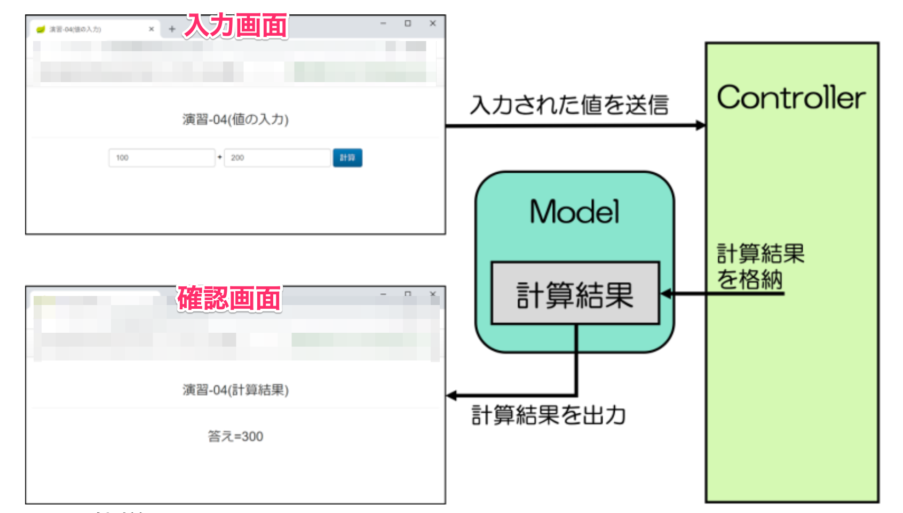

# フォームの利用

Spring MVCでフォームを使ったリクエストパラメーターの取得を行ってみます。

## フォームの動作確認

### フォームクラスの作成

ベースパッケージの中に`form`パッケージを作成して`ItemForm.java`クラスを作成します。

- このクラスを入力フォームのデータを入れます。
- `@Data`を付与してゲッター、セッター、toStringを実装します。

### コントローラーの作成

フォームからのデータの入出力を確認するコントローラーを作成します。

- `controller`パッケージに`FormController`を作成します。
- `@ModelAttribute`を付与したメソッドを実装してFormクラス（今回は`ItemForm`）を初期化します。
  - これでModelインターフェースのインスタンスにAttributeとしてItemFormインスタンスが登録されます。
- `@GetMapping("input")`を付与したハンドラメソッドを追加して入力フォームの画面を表示させます。

### Viewの作成

`templates`フォルダに`form`フォルダを作成し`input.html`を作成して入力フォームを作成します。
- `html`タグ部分にThymeleaf対応の属性を追加します。
- `form`タグを作り`th:object`属性の箇所に`FormController`で初期化した属性`itemForm`をこのフォームにセットします。
- `input`タグには`th:field`属性に対応させたいフィールド名を`*{}`の中に指定します。
  - これでテキストボックスの値が入力されたらその値がItemFormインスタンスにセットされます。

この状態で一度、ブラウザで`http://localhost:8080/form/input`動作確認してフォームが表示されるか確認しましょう。

### Formオブジェクトにてパラメータを取得

HTMLのフォームから入力された内容を取り出してみます。
新たにHTTPのポストで受け取れるハンドラメソッドを追加しまます。
  - このハンドラメソッドの引数に`@ModelAttribute`の引数に`itemForm`を指定したItemForm型の引数を用意します。
    - これで入力フォームから送られてきたデータを受け取れます。
  - Modelのオブジェクトを`model`の`addAttribute`メソッドにItemFormオブジェクトをセットしてViewに渡します。

### 確認画面の確認

確認画面にてItemFormの内容が画面に表示されるか確認します。

- ItemFormの値を表示させるために`th:text`属性に`${属性名.フィールド名}`で指定します。

### 動作確認

ブラウザで`http://localhost:8080/form/input`動作確認してフォームで入力された値が確認画面で表示されるか確認

## 演習問題

下図のような遷移になるようにControllerクラス・ハンドラメソッド・Viewを作成しなさい。
- 入力画面で2つの整数値を入力
- 確認画面で2つの整数値を足し合わせた値を出力

|クラス名（FQCN）|アノテーション|
|---|---|
|`com.example.demo.controller.Practice02Controller`|`@RequestMapping("practice02")`

画面名|メソッド名|アノテーション|戻り値
---|---|---|---
入力画面|input|`@GetMapping`|practice02/input
確認画面|confirm|`@PostMapping`|practice02/confirm