# mybatisの動作確認・演習

## 環境構築

### PostgreSQLにDB、テーブル追加

下記のSQLを`psql`を使ってPostgreSQLにユーザ（ロール）、DB、テーブルを登録してください。

- [DB、ロール作成用SQL](sql/create_user.sql)
- [テーブル作成用SQL](sql/create_table.sql)

### Mybatipseプラグインのインストール

Mybatisを効率よく実装するためにはeclipseに「mybatipse」というプラグインを入れたほうがいいので下記の手順でプラグインをインストールしてください。

eclipseの「ヘルプ -> Eclipseマーケットプレイス」を選択します。


検索の入力欄に「mybatipse」を入力して「Go」ボタンをクリックすると、Mybatipseのプラグインが絞り込まれますので、「インストール」ボタンをクリックしてインストールします。


次の画面では「使用条件の条項に同意します」のラジオボタンをクリックして「完了」ボタンをクリックします。

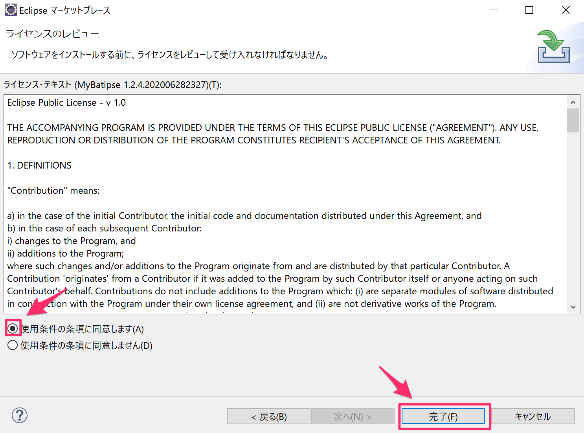

「インストール」ボタンをクリックします。


インストール完了後にeclipseの再起動を促されますので再起動してください。


これでMybatipseプラグインのインストールは完了です。

## 動作確認

### 依存関係の追加

Mybatisを利用するためにはAOPと同様にプロジェクトに依存関係（外部ライブラリ）を追加する必要があります。

下図のとおりに`build.gradle`の中の`dependencies`のブロックの中に依存関係を追加してください。


`build.gradle`を保存したらライブラリがダウンロードされ、プロジェクトでライブラリのAPIが利用できるようになります。

### DB接続情報の設定

DB接続情報を設定します。`src/main/resources`の中にある`application.properties`ファイルの中にDB接続情報を下図のとおり入れてください。

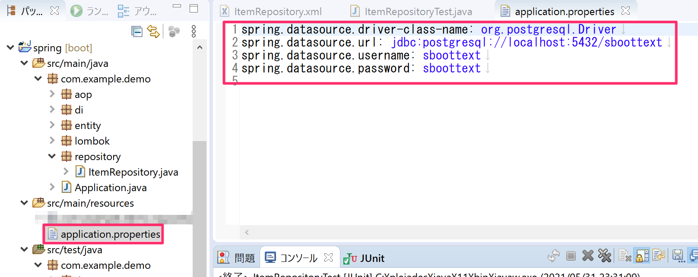

### Entityの作成

DBのテーブルの1レコード分を格納するためのEntityクラスを作成します。
今回は`Item`テーブルのデータを格納する`Item.java`クラスを`com.example.demo.entity`パッケージの中に作成して、下図のようにテーブルのカラムに合わせてフィールドを定義します。

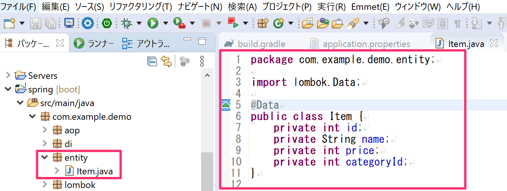

### Mapperインターフェースの作成

次に、DBアクセス処理に責務をもつRepositoryのMapperインターフェースを作成します。

- `@Mapper`アノテーションをこのインターフェースに付与することによりMybatisとSpring Frameworkが自動的にDBアクセス処理を実装したクラスを作成してDIで呼び出せるようになります。

`com.example.demo.repository`のパッケージの中に`ItemRepository.java`インターフェースを作成し、データアクセスの抽象メソッドを定義します。

- 今回はとりあえずレコード全件参照するメソッドである`selectAll`という抽象メソッドを定義しています。

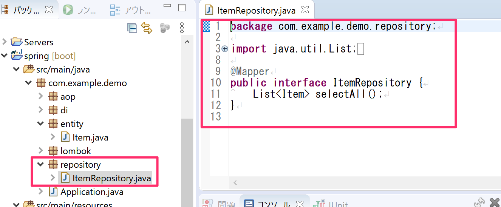

### MapperXMLの作成

次にMapperインターフェースのメソッドを呼び出したときに、実行されるSQLを定義するMapperXMLファイルを作成します。

`src/main/resources`の箇所で右クリックして「新規 -> フォルダ」を選択して、下図のように**Mapperインターフェースと同じパッケージ階層と同じフォルダを作成してください。**

- フォルダを多段階層をまとて作成する場合には`/`（スラッシュ区切り）で作成できます。

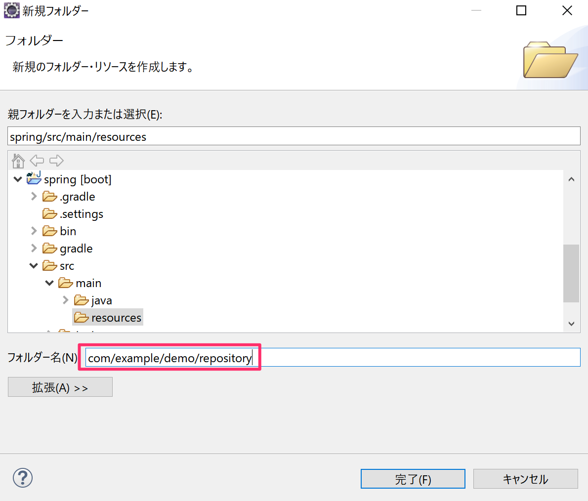

次に、作成した`src/main/resources/com/example/demo/repository`の場所で右クリックして「新規 -> その他」を選択し、下図のウィザード画面で「Mybatis -> Mybatis XML Mapper」を選び「次へ」を作成します。


今回は`ItemRepository.java`に対応したMapperXMLを作成するので`ItemRepository.xml`ファイルとして作成します。

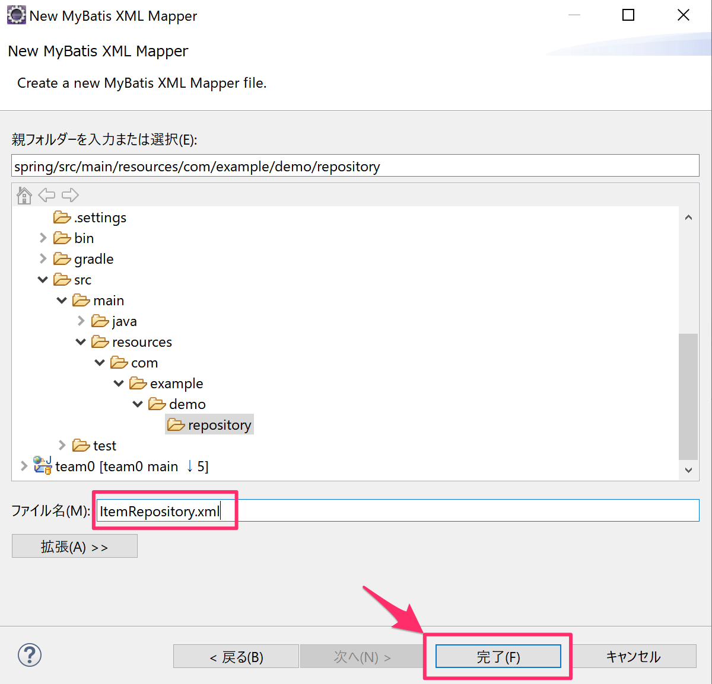

XMLファイルの中に`<select>`タグで囲った部分を作り、その中にItemテーブルを全件取得するSQL文を定義します。

- `<select>`タグの中の`id`属性には`ItemRepository.java`で定義した抽象メソッド名を指定してます。（それでそのメソッドを実行したときにこのSQLが実行されます）
- `<select>`タグの中の`resultType`属性にはSQLにて取得できたレコードを格納するEntityクラスのFQCN（パッケージを含めたクラス名）を指定します。

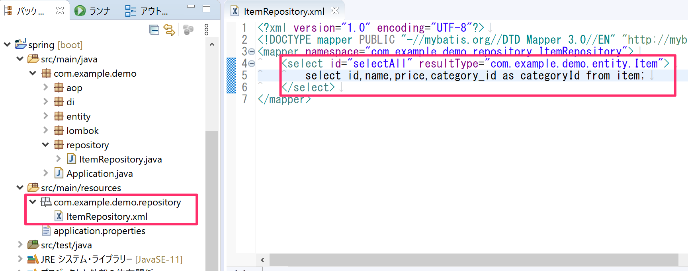

### DBの初期データの用意

Spring Bootでは`src/main/resources`の配下に初期化するSQLファイルを用意しておけば、テスト実行毎に初期化して実行する事ができます。

`src/main/resources`に`sql`フォルダを作成して`data.sql`を作成します。

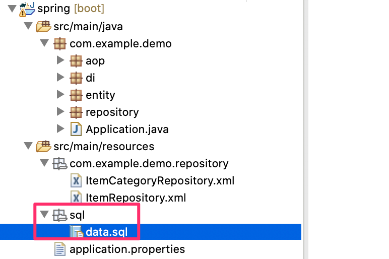

`data.sql`の中身は下記のようにしてください。

```sql
drop table if exists item;
drop table if exists item_category;

create table item_category(
  id serial primary key,
  name character varying(20)
);

create table item(
  id serial primary key,
  name character varying(30),
  price integer,
  category_id integer references item_category(id)
);

/* 商品カテゴリ */
insert into item_category values(nextval('item_category_id_seq'),'文房具');
insert into item_category values(nextval('item_category_id_seq'),'雑貨');
insert into item_category values(nextval('item_category_id_seq'),'パソコン周辺機器');

/* 商品 */
insert into item values(nextval('item_id_seq'),'水性ボールペン(黒)',120,1);
insert into item values(nextval('item_id_seq'),'水性ボールペン(赤)',120,1);
insert into item values(nextval('item_id_seq'),'水性ボールペン(青)',120,1);
insert into item values(nextval('item_id_seq'),'油性ボールペン(黒)',100,1);
insert into item values(nextval('item_id_seq'),'油性ボールペン(赤)',100,1);
insert into item values(nextval('item_id_seq'),'油性ボールペン(青)',100,1);
insert into item values(nextval('item_id_seq'),'蛍光ペン(黄)',130,1);
insert into item values(nextval('item_id_seq'),'蛍光ペン(赤)',130,1);
insert into item values(nextval('item_id_seq'),'蛍光ペン(青)',130,1);
insert into item values(nextval('item_id_seq'),'蛍光ペン(緑)',130,1);
insert into item values(nextval('item_id_seq'),'鉛筆(黒)',100,1);
insert into item values(nextval('item_id_seq'),'鉛筆(赤)',100,1);
insert into item values(nextval('item_id_seq'),'色鉛筆(12色)',400,1);
insert into item values(nextval('item_id_seq'),'色鉛筆(48色)',1300,1);
insert into item values(nextval('item_id_seq'),'レザーネックレス',300,2);
insert into item values(nextval('item_id_seq'),'ワンタッチ開閉傘',3000,2);
insert into item values(nextval('item_id_seq'),'金魚風呂敷',500,2);
insert into item values(nextval('item_id_seq'),'折畳トートバッグ',600,2);
insert into item values(nextval('item_id_seq'),'アイマスク',900,2);
insert into item values(nextval('item_id_seq'),'防水スプレー',500,2);
insert into item values(nextval('item_id_seq'),'キーホルダ',800,2);
insert into item values(nextval('item_id_seq'),'ワイヤレスマウス',900,3);
insert into item values(nextval('item_id_seq'),'ワイヤレストラックボール',1300,3);
insert into item values(nextval('item_id_seq'),'有線光学式マウス',500,3);
insert into item values(nextval('item_id_seq'),'光学式ゲーミングマウス',4800,3);
insert into item values(nextval('item_id_seq'),'有線ゲーミングマウス',3800,3);
insert into item values(nextval('item_id_seq'),'USB有線式キーボード',1400,3);
insert into item values(nextval('item_id_seq'),'無線式キーボード',1900,3);
```

### テストクラスの作成

これでとりあえず全件取得の処理はできるようになりましたので、テストクラスを作って動作確認してみます。

`src/test/java`の中の`com.example.demo.repository`パッケージの中に`ItemRepositoryTest.java`クラスを作成し、下図のようにテストケースを作成してください。

- `@Mapper`アノテーションを付与した`ItemRepository`インターフェース型の変数を用意し、`@Autowired`でインジェクション対象にします
  - これでMybatisとSpring FrameworkのDIでDB操作インスタンスが注入されます。
- `@Sql`アノテーションにてテスト実行前に初期化するSQLファイルを指定しています。
  - これにより再帰的にDBのテストを実行させる事が可能です。

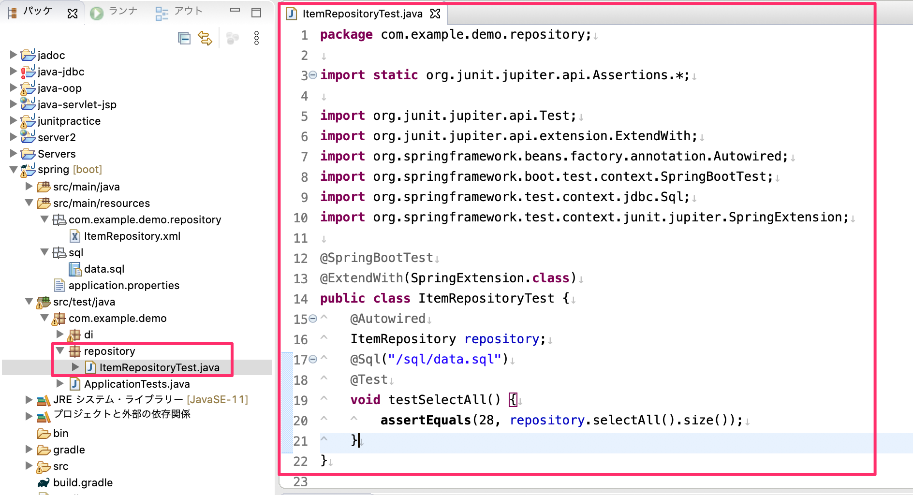

JUnitテストを実行すると下図のようにコンソールにDBテーブルの内容が出力される事を確認してください。

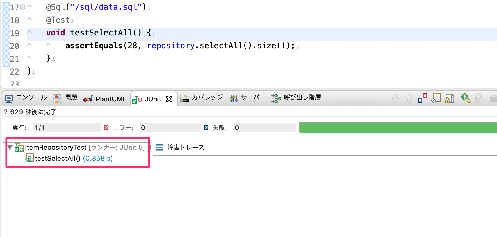

## 演習問題

### 1件取得

- 上記とテキストを参考に`ItemRepository.java`と`ItemRepository.xml`を更新してItemテーブルのレコードをIDを指定して1件取得する処理を実装してください
  - 取得の確認は`ItemRepositoryTest.java`にテストケースを作り確認してください。

### 1件登録

- 上記とテキストを参考に`ItemRepository.java`と`ItemRepository.xml`を更新してレコードを1件登録する処理を実装してください
  - 登録の確認は`ItemRepositoryTest.java`にテストケースを作り確認してください。
  - 登録処理時のIDはPostgreSQLのシーケンスを使って登録してください（テキストの60ページ参照）

### 1件更新

- 上記とテキストを参考に`ItemRepository.java`と`ItemRepository.xml`を更新してレコードを1件更新する処理を実装してください
  - 更新の確認は`ItemRepositoryTest.java`にテストケースを作り確認してください。

### 1件削除

- 上記とテキストを参考に`ItemRepository.java`と`ItemRepository.xml`を更新してレコードを1件削除する処理を実装してください
  - 削除の確認は`ItemRepositoryTest.java`にテストケースを作り確認してください。

## 追加演習

`src/main/resource/sql/data.sql`に下記を追加してMybatisを使って基本的なCRUDを実装してください。

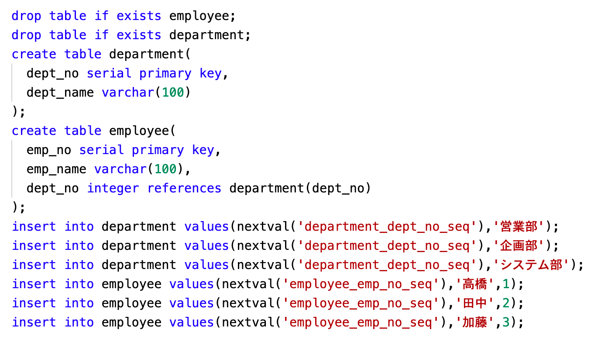