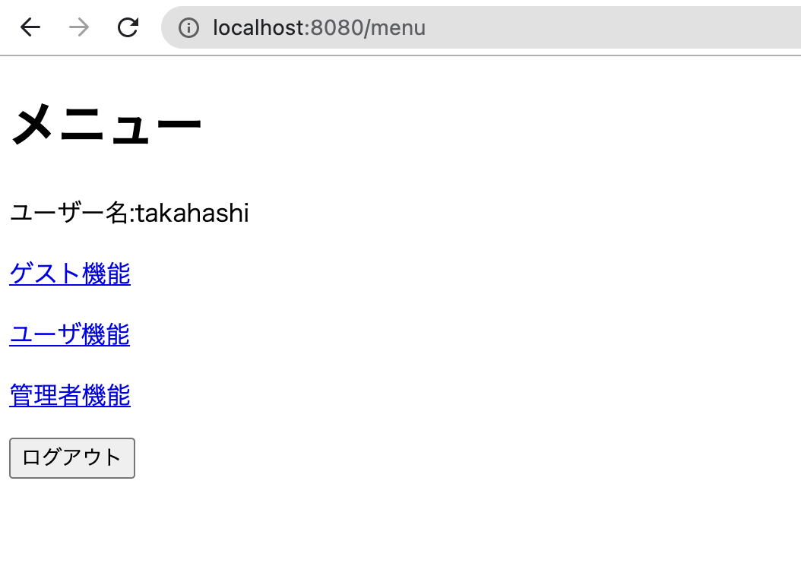
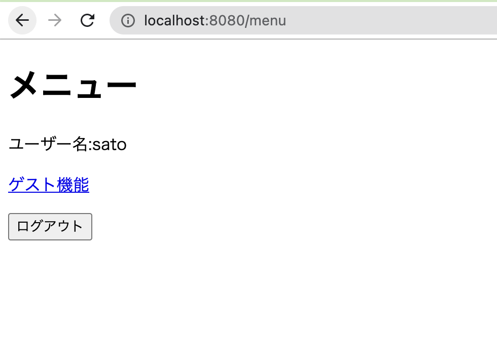

# Spring Securityの動作確認

## 環境構築

### テーブル定義ファイル作成

_src/main/rerouces/sql/account_data.sql_

```sql
drop table if exists account;
drop table if exists account_role;

create table account_role(
    id serial primary key,
    name varchar(100) not null
);
insert into account_role values(1,'admin');
insert into account_role values(2,'user');
insert into account_role values(3,'guest');

create table account(
    id serial primary key,
    name varchar(100) not null,
    password varchar(100) not null,
    account_role_id integer references account_role(id)
);
```

### 依存関係の追加

_build.gradle_

```js
plugins {
	id 'org.springframework.boot' version '2.5.0'
	id 'io.spring.dependency-management' version '1.0.11.RELEASE'
	id 'java'
}
group = 'com.example'
version = '0.0.1-SNAPSHOT'
sourceCompatibility = '11'

configurations {
	compileOnly {
		extendsFrom annotationProcessor
	}
}
repositories {
	mavenCentral()
}
dependencies {
    // db
	implementation "org.mybatis.spring.boot:mybatis-spring-boot-starter:1.3.2"
	implementation 'org.springframework.boot:spring-boot-starter-data-jdbc'
	runtimeOnly 'org.postgresql:postgresql'
    // security
	implementation 'org.springframework.boot:spring-boot-starter-security'
	implementation 'org.springframework.security:spring-security-config'
    implementation 'org.thymeleaf.extras:thymeleaf-extras-springsecurity5'
    // web
	implementation 'org.springframework.boot:spring-boot-starter-thymeleaf'
	implementation 'org.springframework.boot:spring-boot-starter-web'
	// lombok
    compileOnly 'org.projectlombok:lombok'
	annotationProcessor 'org.projectlombok:lombok'
    // devtools
    developmentOnly 'org.springframework.boot:spring-boot-devtools'
    // test
	testImplementation 'org.springframework.boot:spring-boot-starter-test'
	testImplementation 'org.springframework.security:spring-security-test'
}
test {
	useJUnitPlatform()
}
```

## ユーザの登録機能実装

### Entityの実装

_com.example.demo.entity.Account.java_

```java
package com.example.demo.entity;

import lombok.AllArgsConstructor;
import lombok.Data;
import lombok.NoArgsConstructor;

@NoArgsConstructor
@AllArgsConstructor
@Data
public class Account {
    private Integer id;
    private String name;
    private String password;
    private AccountRole role;
}
```

_com.example.demo.entity.AccountRole.java_

```java
package com.example.demo.entity;

import lombok.AllArgsConstructor;
import lombok.Data;
import lombok.NoArgsConstructor;

@NoArgsConstructor
@AllArgsConstructor
@Data
public class AccountRole {
    private Integer id;
    private String name;
}
```

### Repositoryの実装

_com.example.demo.repository.AccountRepository.java_

```java
package com.example.demo.repository;

import com.example.demo.entity.Account;
import org.apache.ibatis.annotations.Mapper;

@Mapper
public interface AccountRepository {
    void insert(Account account);
}
```

_src/main/resources/com/example/demo/repository/AccountRepository.xml_

```xml
<?xml version="1.0" encoding="UTF-8"?>
<!DOCTYPE mapper PUBLIC
        "-//mybatis.org//DTD Mapper 3.0//EN"
        "http://mybatis.org/dtd/mybatis-3-mapper.dtd">
<mapper namespace="com.example.demo.repository.AccountRepository">
    <insert id="insert" parameterType="com.example.demo.entity.Account">
        <selectKey keyProperty="id" resultType="int" order="BEFORE">
            select nextval('account_id_seq');
        </selectKey>
        insert into account values(#{id},#{name},#{password},#{role.id});
    </insert>
</mapper>
```

### Serviceの実装

_com.example.demo.service.AccountService.java_

```java
package com.example.demo.service;

import com.example.demo.entity.Account;

public interface AccountService {
    void addAccount(Account account);
}
```

_com.example.demo.service.AccountServiceImpl.java_

```java
package com.example.demo.service;

import com.example.demo.entity.Account;
import com.example.demo.repository.AccountRepository;
import org.springframework.beans.factory.annotation.Autowired;
import org.springframework.stereotype.Service;

@Service
public class AccountServiceImpl implements AccountService{
    @Autowired
    AccountRepository repository;

    @Override
    public void addAccount(Account account) {
        repository.insert(account);
    }
}
```

### パスワードエンコードのDI設定

_com.example.demo.service.AccountServiceImpl.java_

```java
package com.example.demo.service;

import com.example.demo.entity.Account;
import com.example.demo.repository.AccountRepository;
import org.springframework.beans.factory.annotation.Autowired;
import org.springframework.stereotype.Service;

@Service
public class AccountServiceImpl implements AccountService{
    @Autowired
    AccountRepository repository;

    @Override
    public void addAccount(Account account) {
        repository.insert(account);
    }
}
```

### Serviceのテスト

_(src/test/java)com.example.demo.service.AccountServiceImpl.java_

```java
package com.example.demo.service;

import com.example.demo.entity.Account;
import com.example.demo.entity.AccountRole;
import org.junit.jupiter.api.Test;
import org.junit.jupiter.api.extension.ExtendWith;
import org.springframework.beans.factory.annotation.Autowired;
import org.springframework.boot.test.context.SpringBootTest;
import org.springframework.security.crypto.password.PasswordEncoder;
import org.springframework.test.context.jdbc.Sql;
import org.springframework.test.context.junit.jupiter.SpringExtension;

@SpringBootTest
@ExtendWith(SpringExtension.class)
public class AccountServiceTest {
    @Autowired AccountService service;
    @Autowired PasswordEncoder encoder;
    @Sql("/sql/account_data.sql")
    @Test
    void testAddAccount(){
        service.addAccount(
            new Account(
                null, "takahashi", 
                encoder.encode("passtaka"),
                new AccountRole(1,"admin")
            )
        );
        service.addAccount(
            new Account(
                null, "kato",
                encoder.encode("passkato"),
                new AccountRole(2,"user")
            )
        );
        service.addAccount(
            new Account(
                null, "sato",
                encoder.encode("passaato"),
                new AccountRole(3,"guest")
            )
        );
    }
}
```

## 認証・認可機能の実装

### UserDetailインターフェース実装クラスの実装

_com.example.demo.security.AccountUserDetail.java_

```java
package com.example.demo.security;

import com.example.demo.entity.Account;
import org.springframework.security.core.GrantedAuthority;
import org.springframework.security.core.userdetails.UserDetails;

import java.util.Collection;

public class AccountUserDetail implements UserDetails {
    private final Account account;
    private final Collection<GrantedAuthority> authorities;

    public AccountUserDetail(Account account, Collection<GrantedAuthority> authorities){
        this.account = account;
        this.authorities = authorities;
    }

    @Override
    public Collection<? extends GrantedAuthority> getAuthorities() {
        return this.authorities;
    }

    @Override
    public String getPassword() {
        return this.account.getPassword();
    }

    @Override
    public String getUsername() {
        return this.account.getName();
    }

    @Override
    public boolean isAccountNonExpired() {
        return true;
    }

    @Override
    public boolean isAccountNonLocked() {
        return true;
    }

    @Override
    public boolean isCredentialsNonExpired() {
        return true;
    }

    @Override
    public boolean isEnabled() {
        return true;
    }
}
```

### UserDetailServiceインターフェース実装クラスの実装

_com.example.demo.security.AccountUserDetailsService.java_

```java
package com.example.demo.security;

import com.example.demo.entity.Account;
import com.example.demo.repository.AccountRepository;
import org.springframework.beans.factory.annotation.Autowired;
import org.springframework.security.core.authority.AuthorityUtils;
import org.springframework.security.core.userdetails.UserDetails;
import org.springframework.security.core.userdetails.UserDetailsService;
import org.springframework.security.core.userdetails.UsernameNotFoundException;
import org.springframework.stereotype.Service;

@Service
public class AccountUserDetailsService implements UserDetailsService {
    @Autowired
    AccountRepository repository;
    @Override
    public UserDetails loadUserByUsername(String username) throws UsernameNotFoundException {
        Account account = repository.findByUsername(username);
        System.out.println(account);
        if(account == null) throw new UsernameNotFoundException("user not found");
        switch (account.getRole().getName()){
            case "admin":
                return new AccountUserDetail(
                    account,
                    AuthorityUtils.createAuthorityList("ROLE_ADMIN","ROLE_USER","ROLE_GUEST")
                );
            case "user":
                return new AccountUserDetail(
                    account,
                    AuthorityUtils.createAuthorityList("ROLE_USER","ROLE_GUEST")
                );
            case "guest":
                return new AccountUserDetail(
                    account,
                    AuthorityUtils.createAuthorityList("ROLE_GUEST")
                );
            default:
                return null;
        }
    }
}
```

### SecurityConfigクラスの実装

_com.example.demo.security.SecurityConfig.java_

```java
package com.example.demo.security;

import org.springframework.beans.factory.annotation.Autowired;
import org.springframework.security.config.annotation.authentication.builders.AuthenticationManagerBuilder;
import org.springframework.security.config.annotation.web.builders.HttpSecurity;
import org.springframework.security.config.annotation.web.builders.WebSecurity;
import org.springframework.security.config.annotation.web.configuration.EnableWebSecurity;
import org.springframework.security.config.annotation.web.configuration.WebSecurityConfigurerAdapter;
import org.springframework.security.crypto.password.PasswordEncoder;

@EnableWebSecurity
public class SecurityConfig extends WebSecurityConfigurerAdapter {
    @Autowired AccountUserDetailsService service;
    @Autowired PasswordEncoder encoder;
    @Autowired
    void configureAuthenticationManager(AuthenticationManagerBuilder auth) throws Exception {
        auth.userDetailsService(service).passwordEncoder(encoder);
    }
    @Override
    public void configure(WebSecurity web) throws Exception {
        super.configure(web);
        web.ignoring().antMatchers("/public/**");
    }
    @Override
    protected void configure(HttpSecurity http) throws Exception {
        http.authorizeRequests()
                .antMatchers("/","/login").permitAll()
                .antMatchers("/menu","/logout").authenticated() // ログイン時に許可
                //.antMatchers().authenticated()
                .antMatchers("/admin","/admin/**").hasRole("ADMIN")// ロール毎の許可
                .antMatchers("/**").denyAll(); // それ以外はアクセス許可しない（認証が必要
        http.formLogin()
                .loginPage("/login")
                .loginProcessingUrl("/auth")
                .usernameParameter("username")
                .passwordParameter("password")
                .defaultSuccessUrl("/menu",true)
                .failureUrl("/login")
                .permitAll();
        http.logout()
                .logoutUrl("/logout")
                .logoutSuccessUrl("/login")
                .invalidateHttpSession(true)
                .deleteCookies("JSESSIONID")
                .clearAuthentication(true)
                .permitAll();
    }
}
```

### コントローラーの実装

_com.example.demo.controller.LoginController.java_

```java
package com.example.demo.controller;

import org.springframework.stereotype.Controller;
import org.springframework.web.bind.annotation.GetMapping;

@Controller
public class LoginController {
    @GetMapping("login")
    public String login(){
        return "login";
    }
    @GetMapping("menu")
    public String menu(){
        return "menu";
    }
}
```

### Viewの実装

_src/main/resources/templates/login.html_

```html
<!DOCTYPE html>
<html lang="ja" xmlns:th="http://www.thymeleaf.org">
<head>
    <meta charset="UTF-8">
    <title>ログイン</title>
</head>
<body>
    <h1>ログイン</h1>
    <div th:if="${session['SPRING_SECURITY_LAST_EXCEPTION'] != null}" style="color:red;">
        <span>
            <span th:text="${session['SPRING_SECURITY_LAST_EXCEPTION'].message}"></span>
        </span>
    </div>
    <form th:action="@{/auth}" method="post">
        ユーザ名:<input type="text" name="username"><br>
        パスワード: <input type="password" name="password"><br>
        <input type="submit" value="ログイン">
    </form>
</body>
</html>
```

_src/main/resources/templates/menu.html_

```html
<!DOCTYPE html>
<html lang="ja" xmlns:th="http://www.tymeleaf.org" xmlns:sec="http://www.w3.org/1999/xhtml">
<head>
    <meta charset="UTF-8">
    <title>メニュー</title>
</head>
<body>
    <h1>メニュー</h1>
    <p>
        <div sec:authorize="isAuthenticated()">
            ユーザー名:<span sec:authentication="principal.username"></span>
            <p sec:authorize="hasRole('GUEST')"><a href="#">ゲスト機能</a></p>
            <p sec:authorize="hasRole('USER')"><a href="#">ユーザ機能</a></p>
            <p sec:authorize="hasRole('ADMIN')"><a href="#">管理者機能</a></p>
            <form th:action="@{/logout}" method="post">
                <input type="submit" value="ログアウト">
            </form>
        </div>
    </p>
</body>
</html>
```

### 動作確認





